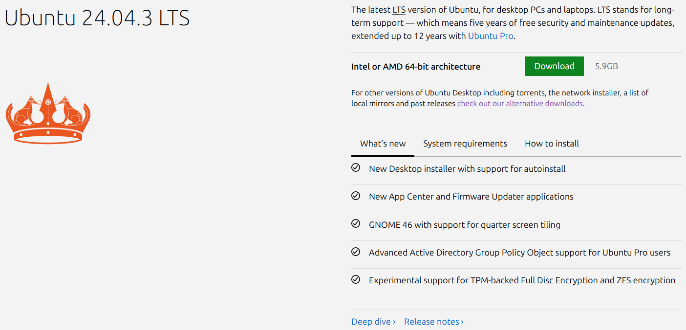

# 💻 Mise en place de l'environnement
Pour commencer, il faut une machine virtuelle (nous utiliserons VirtualBox dans ce tutoriel) avec une distribution Linux (nous avons utilisé Ubuntu 24.04.03 LTS).

> Virtualbox a l'avantage d'être compatible Windows et Mac, le tout en étant gratuit et open-source, et Ubuntu est une distribution populaire et bien documentée, ce qui facilite la résolution des problèmes potentiels.

- Téléchargez et installez [VirtualBox](https://www.virtualbox.org/wiki/Downloads) sur votre machine hôte en sélectionnant la version appropriée pour votre système d'exploitation. 
- Sur le processus d'installation, laissez les options par défaut et cliquez sur "Next" (nous n'avons pas besoins de réglages spécifiques) jusqu'à la fin de l'installation.
- Une fois VirtualBox installé, téléchargez l'[image ISO d'Ubuntu 24.04.03 LTS](https://ubuntu.com/download/desktop) (Faites attention de choisir une version compatible avec votre architecture ordinateur, dans la plupart des cas, il s'agit de la version 64 bits).
- Une fois tout téléchargé, lancez VirtualBox et cliquez sur "New" ou "Nouveau" pour créer une nouvelle machine virtuelle et remplissez le nom de la machine virtuelle, son dossier d'installation, et choisissez l'image ISO d'Ubuntu téléchargée, le reste va etre rempli automatiquement.
- Faites attention a bien choisir la quantité de RAM, de CPU et de mémoire allouée a la machine virtuelle, nous recommandons de faire en fonction de votre machine hôte, mais pour un bon fonctionnement, nous recommandons au minimum 4Go de RAM, 2 CPU et 20Go de mémoire.

- Une fois tout configuré, cliquez sur "Finish" ou "Fin" pour créer la machine virtuelle et démarrez votre machine virtuelle en double cliquant dessus.
> ⚠️ Il est possible que VirtualBox vous demande de parametrer les comptes utilisateurs avant de lancer la machine virtuelle, faites le si c'est le cas et n'oubliez pas de noter vos identifiants. Si vous les oubliez, vous devrez repartir de zéro et réinstaller la machine virtuelle.
- Une fois la machine virtuelle démarrée, suivez les instructions a l'écran pour installer Ubuntu sur la machine virtuelle (choisissez la langue, le fuseau horaire, la disposition clavier, le nom d'utilisateur et le mot de passe).

- Bravo ! 🎉 Vous avez installé Ubuntu sur votre machine virtuelle. Vous pouvez maintenant continuer sur [l'installation de Snort/Wazuh](./Installation%20Snort_Wazuh.md).