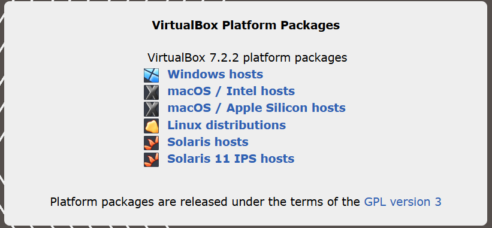
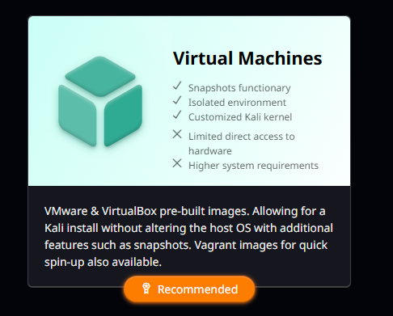
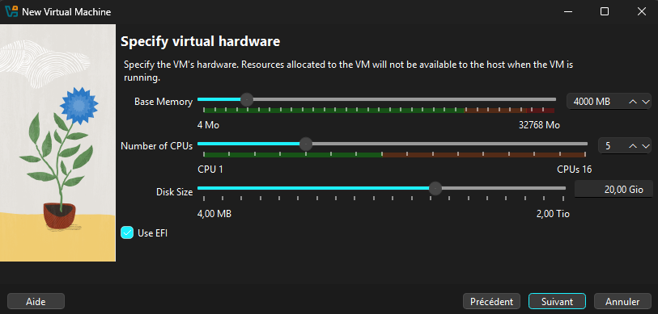

# 💻 Mise en place de l'environnement

Pour commencer, il faut une machine virtuelle (nous utiliserons VirtualBox dans ce tutoriel) avec une distribution Linux (nous avons utilisé Kali Linux 2025.3).

> VirtualBox a l'avantage d'être compatible Windows et Mac, le tout en étant gratuit et open-source, et Kali Linux est une distribution spécialisée pour la cybersécurité et les tests d'intrusion, largement utilisée par les professionnels du domaine.

- Téléchargez et installez [VirtualBox](https://www.virtualbox.org/wiki/Downloads) sur votre machine hôte en sélectionnant la version appropriée pour votre système d'exploitation. 

- Pendant le processus d'installation, laissez les options par défaut et cliquez sur "Next" (nous n'avons pas besoin de réglages spécifiques) jusqu'à la fin de l'installation.

- Une fois VirtualBox installé, téléchargez l'[image ISO de Kali Linux 2025.3](https://www.kali.org/get-kali/), Kali propose des versions préconfigurées Virtual Machine dont une version VirtualBox. 

- Une fois tout téléchargé, lancez VirtualBox et cliquez sur "New" ou "Nouveau" pour créer une nouvelle machine virtuelle. Remplissez le nom de la machine virtuelle, son dossier d’installation, et sélectionnez l’image ISO de Kali Linux téléchargée. Le reste des paramètres sera complété automatiquement.

- Faites attention à bien choisir la quantité de RAM, de CPU et de mémoire allouée à la machine virtuelle. Nous recommandons d’adapter ces valeurs en fonction de votre machine hôte, mais pour un bon fonctionnement de Kali, prévoyez au minimum :
  - 4 Go de RAM
  - 2 CPU
  - 25 Go d’espace disque

- Une fois tout configuré, cliquez sur "Finish" ou "Fin" pour créer la machine virtuelle et démarrez votre machine virtuelle en double-cliquant dessus.

> ⚠️ Il est possible que VirtualBox vous demande de paramétrer les comptes utilisateurs avant de lancer la machine virtuelle. Faites-le si c’est le cas et **notez bien vos identifiants**. Si vous les oubliez, vous devrez repartir de zéro et réinstaller la machine virtuelle.

- Une fois la machine virtuelle démarrée, suivez les instructions à l’écran pour installer Kali Linux sur la machine virtuelle (choisissez la langue, le fuseau horaire, la disposition du clavier, le nom d’utilisateur et le mot de passe).

- Bravo ! 🎉 Vous avez installé Kali Linux sur votre machine virtuelle. Vous pouvez maintenant continuer sur [l’installation de Snort](./Installation%20Snort.md).
