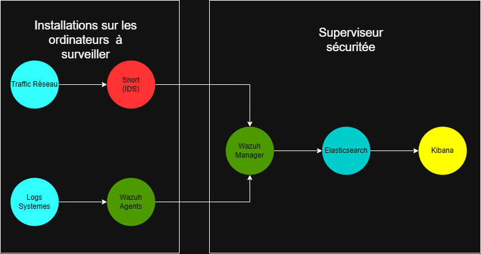

# SecInf_Projet1
Système de détection d'anomalies et de gestion de logs pour la sécurité des réseaux
## Sommaire
Pour les différentes machines virtuelles à installer, suivez les guides d'installation ci-dessous :
- [💻 Mise en place de l'environnement](./Installations/Pour%20Commencer.md)
- [📡 Installation de Snort/Wazuh Agents](./Installations/Installation%20Snort_Wazuh.md)

Pour le serveur principal de gestion des logs et d'affichage des données, suivez les guides d'installation ci-dessous :
- [🧮 Installation de Wazuh Manager](./Installations/Installation%20Wazuh%20Manager.md)
- [🧮 Installation d'ElasticSearch/Kibana](./Installations/Installation%20ElasticSearch_Kibana.md)
## Objectifs
L'objectif de ce projet est de mettre en place une architecture de sécurité réseau basée sur des outils open-source, permettant une détection d'intrusions et la gestion centralisée des logs classique dans l'industrie. Cette architecture vise à renforcer la sécurité des systèmes informatiques en surveillant le trafic réseau et en analysant les événements de sécurité, ce qui peut etre nécessaire dans des systemes informatiques d'entreprises ou d'organisations.
## Outils utilisés
- Snort : Système de détection d'intrusion (IDS) open-source qui analyse le trafic réseau en temps réel pour détecter des activités suspectes ou malveillantes. https://www.snort.org

- Wazuh : Plateforme de sécurité open-source qui fournit des fonctionnalités de gestion des logs, de détection d'intrusions et de surveillance de l'intégrité des fichiers. https://wazuh.com

- ElasticSearch : Moteur de recherche et d'analyse open-source utilisé pour stocker, rechercher et analyser de grandes quantités de données en temps réel. https://www.elastic.co/fr/elasticsearch/

- Kibana : Outil de visualisation open-source qui permet de créer des tableaux de bord interactifs pour analyser et visualiser les données stockées dans ElasticSearch. https://www.elastic.co/fr/kibana/

- Ubuntu : Distribution Linux populaire utilisée comme système d'exploitation pour les machines virtuelles dans ce projet. https://ubuntu.com

- VirtualBox : Logiciel de virtualisation open-source qui permet de créer et de gérer des machines virtuelles sur un ordinateur hôte, ce qui nous a permis de simuler un environnement réseau complexe. https://www.virtualbox.org
## Architecture globale

Comme on peut le voir sur le diagramme, l'architecture est composée en deux parties principales : le ou les installations de Snort/Wazuh Agent sur des machines virtuelles clientes, et l'installation de Wazuh Manager, ElasticSearch et Kibana sur une machine virtuelle serveur centrale.

Snort analyse le trafic réseau sur les machines clientes et génère des alertes en cas de détection d'activités suspectes. Wazuh Agent collecte ces alertes ainsi que d'autres logs systèmes et les envoie au serveur central Wazuh Manager.

Wazuh Manager centralise la gestion des logs et des alertes, en les stockant dans ElasticSearch pour une analyse ultérieure. Kibana fournit une interface graphique pour visualiser et analyser les données stockées dans ElasticSearch, permettant aux administrateurs de surveiller l'état de sécurité du réseau et de réagir rapidement aux incidents.
## Materiel requis
> Pour ce qui est des machines virtuelles, elles ont chacune besoin de minimum 8Go de RAM, 20Go d'espace disque disponible et un processeur avec la virtualisation activée ainsi qu'une connexion internet.